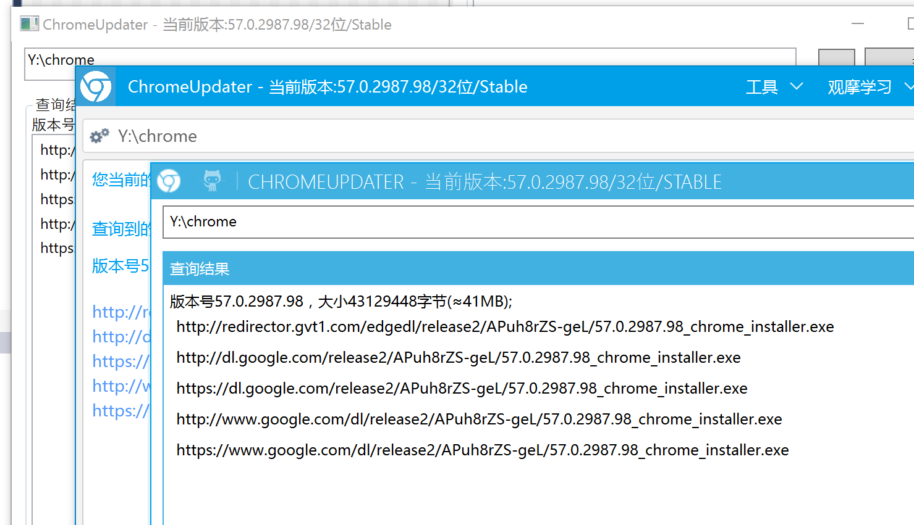

##这是什么 ？

这是一个非常简单的 chrome 更新程序。

##本项目在[耍下更新器1.0.0.0](https://github.com/TkYu/ChromeUpdater)的基础上进行二次开发
耍下更新器已停更，chrome安装包耍下服务器不在提供，改用从谷歌官方服务器获取，需设置翻墙，请自行设置代理服务器。

###项目：

####*ChromeUpdaterCore
核心函数类库，你可以：

* 使用 ChromeUpdaterCore.GetUpdateFromGoogle 获取 chrome 下载链接。
* 使用 ChromeUpdaterCore.GetUpdateFromShuax 在中国获取 chrome 下载链接。
* 使用 ChromeUpdaterCore.DownloadFile 下载文件并检查 sha1。
* 使用 ChromeUpdaterCore.Extract 提取压缩文件。 （如果你有 7-zip 或 WinRAR，它会自动调用）

**和**
将 ChromeUpdaterCore 实例绑定到 wpf DataContext ：

* 绑定 CmdCheckUpdate 命令进行检查更新。
* 绑定 CmdDownload 命令以下载 chrome 安装程序。
* 绑定 CmdDownloadAndExtract 命令以下载 chrome 安装程序并解压缩。
* 绑定 CmdCopyToClipboard 命令，用于将内容复制到剪贴板。

####*我们这里有三个 UI 实现（基于 MVVM）

* ChromeUpdater.BasicWPFUI
* ChromeUpdater.ArthasUI  只更新此UI，其他UI请自行参照更改。
* ChromeUpdater.MahAppsUI

Choose any UI you like.

###You can compile these to try it by yourself.

1) Get source code

    git clone https://github.com/TkYu/ChromeUpdater.git
    
2) Compile

  a) Open ChromeUpdater.sln with Visual Studio 2017.

  b) Set ChromeUpdater.ArthasUI as StartUp Project

  c) Ctrl + F5 or F5

PS:This is a MVVM project.

## Licence

Microsoft Public License (Ms-PL)

This license governs use of the accompanying software. If you use the software, you
accept this license. If you do not accept the license, do not use the software.

1. Definitions
The terms "reproduce," "reproduction," "derivative works," and "distribution" have the
same meaning here as under U.S. copyright law.
A "contribution" is the original software, or any additions or changes to the software.
A "contributor" is any person that distributes its contribution under this license.
"Licensed patents" are a contributor's patent claims that read directly on its contribution.

2. Grant of Rights
(A) Copyright Grant- Subject to the terms of this license, including the license conditions and limitations in section 3, each contributor grants you a non-exclusive, worldwide, royalty-free copyright license to reproduce its contribution, prepare derivative works of its contribution, and distribute its contribution or any derivative works that you create.
(B) Patent Grant- Subject to the terms of this license, including the license conditions and limitations in section 3, each contributor grants you a non-exclusive, worldwide, royalty-free license under its licensed patents to make, have made, use, sell, offer for sale, import, and/or otherwise dispose of its contribution in the software or derivative works of the contribution in the software.

3. Conditions and Limitations
(A) No Trademark License- This license does not grant you rights to use any contributors' name, logo, or trademarks.
(B) If you bring a patent claim against any contributor over patents that you claim are infringed by the software, your patent license from such contributor to the software ends automatically.
(C) If you distribute any portion of the software, you must retain all copyright, patent, trademark, and attribution notices that are present in the software.
(D) If you distribute any portion of the software in source code form, you may do so only under this license by including a complete copy of this license with your distribution. If you distribute any portion of the software in compiled or object code form, you may only do so under a license that complies with this license.
(E) The software is licensed "as-is." You bear the risk of using it. The contributors give no express warranties, guarantees or conditions. You may have additional consumer rights under your local laws which this license cannot change. To the extent permitted under your local laws, the contributors exclude the implied warranties of merchantability, fitness for a particular purpose and non-infringement.